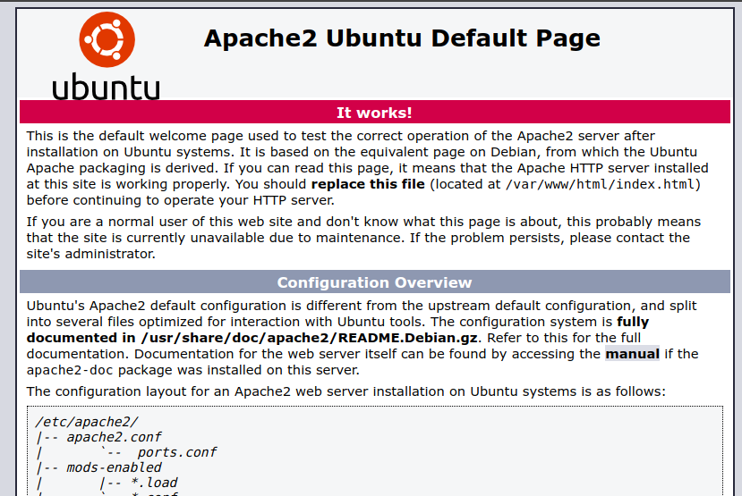

**Install Apache2 steps**


Note: Please check ufw firewall is allowed 'Apache'.

1. Update the system
```
sudo apt update
```

2. Install Apache2
```
sudo apt install apache2
```

3. going to the browser and type http://localhost or IP



Helping command for Apache2

Check the status of Apache2
```
sudo systemctl status apache2
```

Start and stop Apache2
```
sudo systemctl start apache2
```
```
sudo systemctl stop apache2
```
